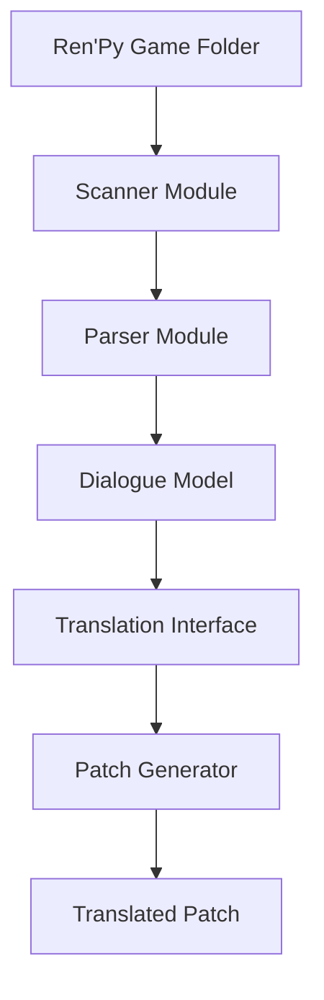

# RenPy Translator

RenPy Translator is a tool designed to simplify the translation workflow for **Ren'Py visual novel games**.

The tool scans Ren'Py script files (`.rpy`), extracts dialogue text, and prepares it for translation and patch generation.

The goal of this project is to make creating translation patches for Ren'Py games easier and more accessible.

---

# Features

Current and planned features:

- Scan Ren'Py game directories
- Detect `.rpy` script files
- Extract dialogue text
- Store dialogue data for translation
- Translation editor interface _(planned)_
- Patch generation system _(planned)_
- Auto translation support _(future)_

---

# Architecture

The system is designed as a modular pipeline.



Pipeline overview:

1. The **scanner** locates `.rpy` script files.
2. The **parser** extracts dialogue from the scripts.
3. Dialogue data is stored using structured **models**.
4. The **UI editor** allows translators to modify text.
5. A **patch generator** builds the final translation patch.

---

# Project Structure

```
renpy-translator
│
├─ core/                 # Core translation engine
│   ├─ parser.py
│   ├─ scanner.py
│   └─ models.py
│
├─ ui/                   # User interface
│   └─ app.py
│
├─ tests/                # Unit tests
│   └─ test_parser.py
│
├─ docs/                 # Technical documentation
│   ├─ architecture.md
│   └─ parser_design.md
│
├─ assets/               # Icons and resources
│
├─ .pre-commit-config.yaml
├─ .gitignore
├─ requirements.txt
├─ LICENSE
└─ README.md
```

---

# Installation

Clone the repository:

```
git clone https://github.com/YOUR_USERNAME/renpy-translator.git
```

Navigate to the project folder:

```
cd renpy-translator
```

Create a virtual environment:

```
python -m venv venv
```

Activate the environment.

Windows:

```
venv\Scripts\activate
```

Linux / macOS:

```
source venv/bin/activate
```

Install dependencies:

```
pip install -r requirements.txt
```

---

# Development Setup

This project uses **pre-commit hooks** to ensure consistent code formatting.

Install hooks:

```
pre-commit install
```

Run checks manually:

```
pre-commit run --all-files
```

Development tools used:

- **Black** → code formatter
- **Ruff** → Python linter
- **isort** → import sorting

---

# Usage

Run the application entry point:

```
python ui/app.py
```

Current output:

```
RenPy Translator UI starting...
```

This is currently a placeholder while the core engine is under development.

---

# Roadmap

Planned development phases:

### Phase 1 — Core Engine

- Implement `.rpy` scanner
- Build dialogue parser
- Design dialogue data models

### Phase 2 — Translation Workflow

- Extract dialogue from scripts
- Manage translation data
- Generate Ren'Py translation patches

### Phase 3 — User Interface

- Translation editor UI
- File management tools

### Phase 4 — Advanced Features

- Automatic translation support
- Translation memory
- Improved parser compatibility

---

# Contributing

Contributions are welcome.

If you'd like to contribute:

1. Fork the repository
2. Create a new branch
3. Commit your changes
4. Submit a Pull Request

You can also open issues for bug reports or feature requests.

---

# License

This project is licensed under the **MIT License**.
